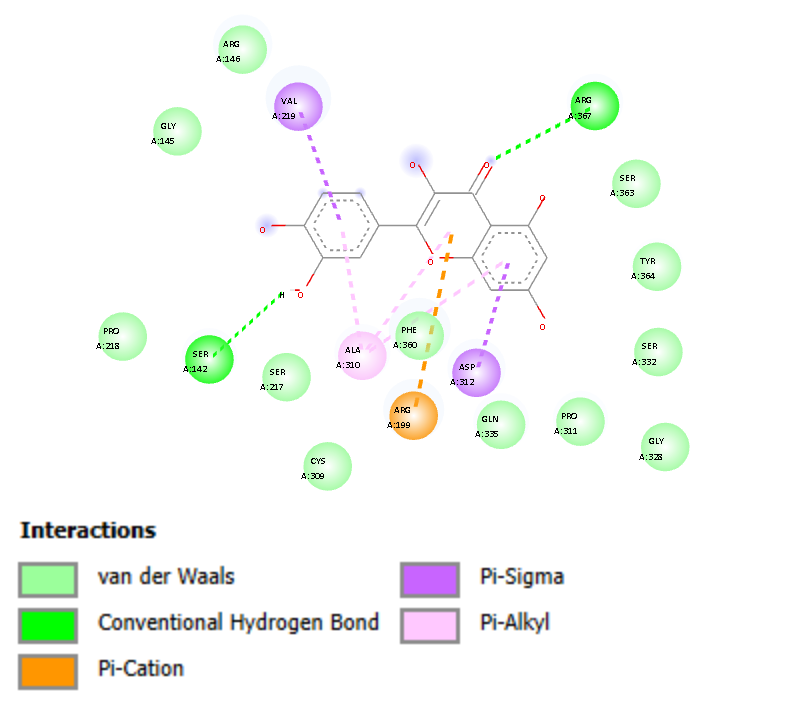
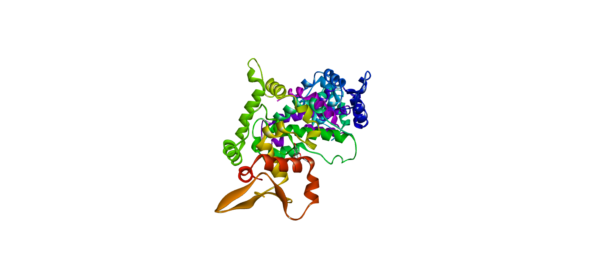

# Hantavirus Molecular Docking

🔬✨ *In Silico Molecular Docking Analysis of Curcumin, Quercetin, and Kaempferol Against Hantavirus Nucleocapsid Protein (5E04)*

---

## 🧬 About This Project

This project explores the potential antiviral activity of natural compounds against the Hantavirus nucleocapsid protein (PDB ID: 5E04) through *in silico molecular docking* analysis.

The docking simulation was carried out using **PyRx** with **AutoDock Vina** to evaluate ligand–protein interactions and compare binding affinity values among tested compounds.

---

## 👥 Team Members

| Name | Student ID |
|---|---|
| Dwinda Jasti | 23/515625/BI/11230 |
| Fanisa Esa Alfira | 23/517678/BI/11267 |
| Fatimah Azzahra Ahda | 23/515606/BI/11229 |
| Karina Safitri | 23/518247/BI/11283 |
| Miftah Fauziyah | 23/521200/BI/11342 |

---

## 🧪 Software & Tools

- PyRx
- AutoDock Vina
- UCSF Chimera
- PyMOL
- BIOVIA Discovery Studio Visualizer
- Open Babel

---

## 🧬 Target Protein

### Hantavirus Nucleocapsid Protein
📌 **PDB ID:** `5E04`

The nucleocapsid protein is essential for viral RNA binding and replication, making it a potential antiviral drug target.

---

## 🌿 Tested Compounds

| Compound | Type |
|---|---|
| Curcumin | Natural polyphenol |
| Quercetin | Flavonoid |
| Kaempferol | Flavonoid |
| Ribavirin | Positive control |

---

## 📊 Docking Results

| Ligand | Binding Affinity (kcal/mol) |
|---|---|
| Ribavirin | -6.3 |
| Curcumin | -6.8 |
| Quercetin | -8.2 |
| Kaempferol | -8.2 |

✅ Quercetin showed the most promising interaction profile due to its strong binding affinity and diverse molecular interactions.

---

## 🖼️ Molecular Docking Visualization

### Workflow
[PDB + PubChem]
        →
[Protein Prep]
        →
[Ligand Prep]
        →
[Docking]
        →
[Analysis]
        →
[Visualization]

---

## 🖼️ Quercetin 2D Interaction

  

---

### Docking Pose Visualization

  

---

---

## 🔁 Reproducibility

1. Download protein structure `5E04` from RCSB Protein Data Bank
2. Download ligand structures from PubChem
3. Prepare protein using UCSF Chimera and AutoDockTools
4. Prepare ligands using PyRx
5. Perform blind docking using AutoDock Vina
6. Analyze docking interactions using Discovery Studio Visualizer and PyMOL

---

## 📄 Project Files

- Final report (.pdf)
- Presentation slides (.pptx / .pdf)
- Protein structure files
- Ligand structure files
- Docking visualization results

---

⭐ *Bioinformatics Mini Project — 2026* ⭐
